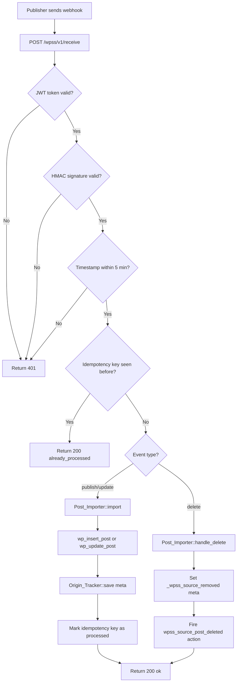

# Architecture — WP Syndication Subscriber

This document explains the design, security model, and resilience strategies of the WP Syndication Subscriber plugin.

---

## System Role

The subscriber plugin is the **receiving end** of the WP Syndication system. It exposes a secure webhook endpoint that the publisher calls whenever content is created, updated, or deleted.



---

## Five-Layer Validation Pipeline

Every incoming request passes through five checks in order. Each failure returns immediately — no partial processing.

```
Request arrives
    │
    ▼
1. Configuration check ── secret_key not set? → 503
    │
    ▼
2. JWT verification ── invalid/expired token? → 401
    │
    ▼
3. HMAC verification ── body tampered or stale timestamp? → 401
    │
    ▼
4. Payload validation ── missing event or post_id? → 400
    │
    ▼
5. Idempotency check ── key seen before? → 200 already_processed
    │
    ▼
6. Process event ── import/update/flag
    │
    ▼
7. Store idempotency key ── only after success
    │
    ▼
Return 200 ok
```

The idempotency check (step 5) comes **after** auth (steps 2-3). This prevents unauthenticated callers from probing which keys exist in the system.

The idempotency key is stored **after** successful processing (step 7). If the server crashes mid-import, the key is not stored — the publisher retries and the import completes cleanly on the next attempt.

---

## Security Model

### Dual-layer authentication

**JWT** (Authorization: Bearer header) — answers "who is calling?"
- Each subscriber gets a unique JWT signed with its own secret key
- Tokens include an `exp` claim (30-day expiry)
- Compromising one token does not affect other subscriber sites

**HMAC-SHA256** (X-WPS-Signature header) — answers "was this tampered with?"
- Signed content: `{timestamp}.{full_body}`
- Any byte changed in transit produces a completely different signature
- Constant-time comparison via `hash_equals()` prevents timing attacks

### Replay attack prevention

```php
// Reject requests older than 5 minutes
if ( abs( time() - (int) $timestamp ) > 300 ) {
    return false;
}
```

An attacker who intercepts a valid signed request cannot replay it after the 5-minute window.

### Idempotency

Every payload has a deterministic `idempotency_key`. The subscriber checks `wp_wpss_idempotency` before processing. The table has a `UNIQUE KEY` constraint — concurrent duplicate inserts are handled by MySQL, not application code. No race condition possible.

---

## "Subscriber Owns Its Copy" Design

When the publisher deletes a post, the subscriber does **not** automatically delete its local copy. Instead:

1. `_wpss_source_removed = 1` meta is set on the local post
2. `wpss_source_post_deleted` action fires with `($local_post_id, $payload)`
3. The subscriber site decides what to do

This is intentional. The subscriber site is an independent WordPress installation with its own editorial workflow. It may want to:
- Keep the post with a "content has moved" notice
- Redirect to the canonical URL on the publisher
- Archive the post quietly
- Delete it immediately

The plugin provides the signal. The site owner provides the response.

```php
// Example: redirect to canonical URL when source is deleted
add_action( 'wpss_source_post_deleted', function( $local_post_id, $payload ) {
    update_post_meta( $local_post_id, '_redirect_to', $payload['canonical_url'] );
}, 10, 2 );
```

---

## Resilience

### What if the import fails mid-way?

The idempotency key is written **after** `wp_insert_post()` succeeds. If anything fails before that point, the key is not stored. The publisher's retry will deliver the webhook again and the import will be attempted fresh.

### What if the same webhook arrives twice simultaneously?

The `UNIQUE KEY` constraint on `idempotency_key` means only one INSERT succeeds. The second concurrent request gets a duplicate key error from MySQL, sees the key already exists, and returns `200 already_processed`. Fully safe under concurrent load.

### What if credentials expire?

JWT tokens have a 30-day expiry. When a token expires, incoming webhooks return 401. The site admin re-registers on the publisher side to get fresh credentials, then re-runs the setup endpoint.

---

## Data Stored Per Imported Post

| Meta key | Value | Use |
|---|---|---|
| `_wpss_source_url` | Publisher site URL | Identify origin |
| `_wpss_canonical_url` | Original permalink | rel=canonical tag |
| `_wpss_source_post_id` | Remote post ID | Map updates to local post |
| `_wpss_synced_at` | Last sync timestamp | Show "last updated" info |
| `_wpss_source_removed` | `1` if source deleted | Trigger redirect/archive logic |

---

## Extension Points

```php
// Allow additional post types to be imported
add_filter( 'wpss_allowed_post_types', function( $types ) {
    return array_merge( $types, array( 'product' ) );
} );

// React when the source post is deleted
add_action( 'wpss_source_post_deleted', function( $local_post_id, $payload ) {
    // e.g. set a redirect, add a notice, or trash the local copy
}, 10, 2 );
```

---

## Contributing

See [CONTRIBUTING.md](./CONTRIBUTING.md) for local setup and testing instructions.
